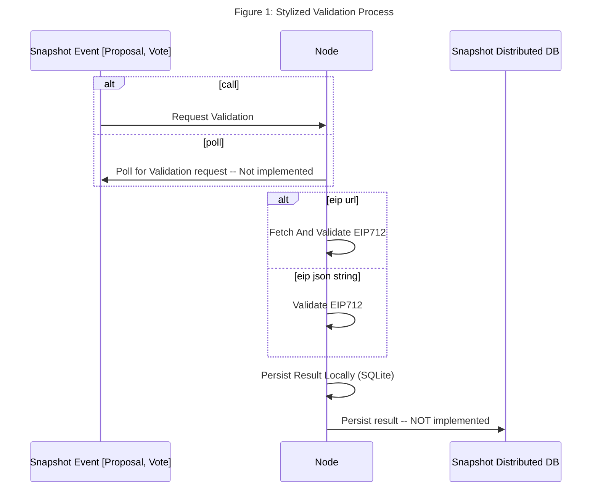
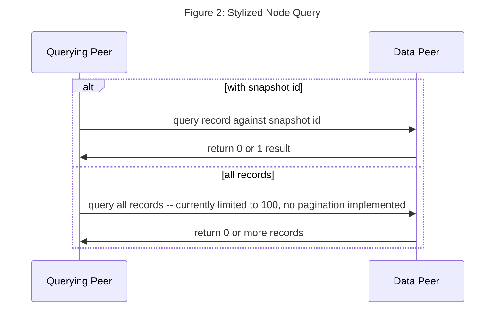

# Snapshot Fluence Node

## Solution Overview

We implemented a Typescript Fluence peer to validate the timestamp of Snapshot events, i.e., proposals and votes, against the node-local timestamp, all UTC. The Snapshot event is presented as a signed EIP712 document which is also verified. 

The implemented peer exposes select interfaces to be used with Aqua and operates as a nearly fully functional peer lacking predominantly the ability to run arbitrary Wasm services. In that sense, the node may be considered a special-purpose service node. In order to facilitate the validations, the peer accepts either an EIP712 json string or link to an url for an EIP712 json string representation, e.g., [IPFS](https://ipfs.fleek.co/ipfs/QmWGzSQFm57ohEq2ATw4UNHWmYU2HkMjtedcNLodYywpmS). The high-level process is depicted in Figure 1.



The PoC implementation does not provide integration with external Snapshot distributed persistence but allows for easy extension to incorporate exogenous storage solutions. The validation process, including not implemented checks, can be found in [eip_validation](./src/eip_processor.ts) and the local persistence in [local sqlite](./src/local_db.ts).

In order to access the services with Aqua, please see [implementation](./aqua/snapshot.aqua), which can be fired from a Typescript client, another peer or the `fldist` command line tool.

In addition, Aqua can be used to query a Peer's local database for already processed validations. This allows new peers, for example, to build up a local history of previously validated events, if so desired. Please note that a consensus algorithm should be implemented and used to manage the sync process. The query process is outlined in Figure 2 below and the Aqua queries are located in [snapshot aqua](./aqua/snapshot.aqua).

The peer-local SQLite table is [implemented](./src/local_db.ts) as:

```sql
    snapshot_id integer unique,
    event_address text,
    event_signature text,
    eip712_doc blob,
    peer_id text,
    timestamp integer,
    eip_validation boolean,
    ts_validation boolean,
    signed_response text
```




TODO:

- [x] Change wallet to use Peer secret key
- [ ] Save Keypair to password protected (local) file


## Running A Peer

Install the Node dependencies and start the peer in the `` directory:

```bash
npm i
npm start
```

Or run with

```bash
nohup node start &
```

for a long-running daemon.

With the node up and running, we can access the validation and query capabilities with Aqua initiated from any other (client) peer including a browser. We can currently call the validation process from [Aqua](./aqua/snapshot.aqua) with two methods: `validate` and `validate_from_url` with the former accepting a json string and the later the url to a json body.

Using the command line utility [`fldist`]("https://doc.fluence.dev/docs/knowledge_tools"), for example, we can run:

TBD
