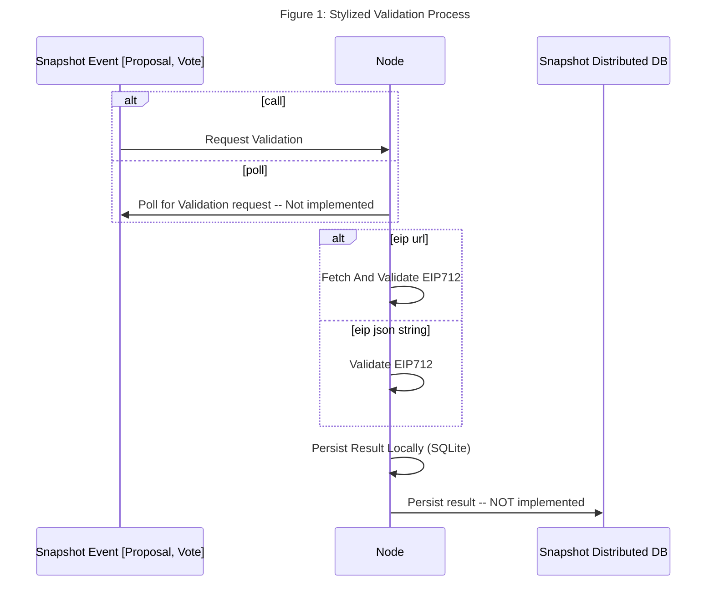
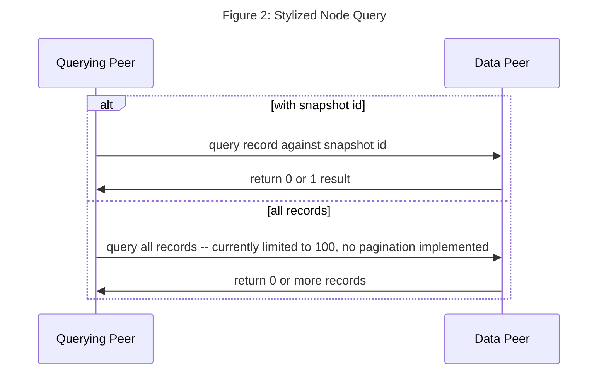

# Snapshot Fluence Node

## Solution Overview

We implemented a Typescript Fluence peer to validate the timestamp of Snapshot events, i.e., proposals and votes, against the node-local timestamp, all UTC. The Snapshot event is presented as a signed EIP712 document which is also verified. 

The implemented peer exposes select interfaces to be used with Aqua and operates as a nearly fully functional peer lacking predominantly the ability to run arbitrary Wasm services. In that sense, the node may be considered a special-purpose service node. In order to facilitate the validations, the peer accepts either an EIP712 json string or link to an url for an EIP712 json string representation, e.g., [IPFS](https://ipfs.fleek.co/ipfs/QmWGzSQFm57ohEq2ATw4UNHWmYU2HkMjtedcNLodYywpmS). The high-level process is depicted in Figure 1.



The PoC implementation does not provide integration with external Snapshot distributed persistence but allows for easy extension to incorporate exogenous storage solutions. The validation process, including not implemented checks, can be found in [eip_validation](./src/eip_processor.ts) and the local persistence in [local sqlite](./src/local_db.ts).

In order to access the services with Aqua, please see the [implementation](./aqua/snapshot.aqua), which can be fired from a Typescript client, another peer or the [`fldist`](https://github.com/fluencelabs/fldist) command line tool or it's successor cli [Aqua](https://github.com/fluencelabs/aqua).

In addition, Aqua can be used to query a Peer's local database for already processed validations. This allows new peers, for example, to build up a local history of previously validated events, if so desired. Please note that a consensus algorithm should be implemented and used to manage the sync process. The query process is outlined in Figure 2 below and the Aqua queries are located in [snapshot aqua](./aqua/snapshot.aqua).

The peer-local SQLite table is [implemented](./src/local_db.ts) as:

```sql
    snapshot_id integer unique,
    event_address text,
    event_signature text,
    eip712_doc blob,
    peer_id text,
    timestamp integer,
    eip_validation boolean,
    ts_validation boolean,
    signed_response text
```




TODO:

- [x] Change wallet to use Peer secret key
- [ ] Save Keypair to password protected (local) file


## Running A Peer

In your terminal in the `peer-node` directory, install the dependencies, compile the Aqua script and start the peer:

```bash
npm i
npm run compile-aqua
npm start
```

And the ensuing terminal output should look like this:

```bash
> snapshot-node-poc@0.1.0 start
> node -r ts-node/register src/index.ts

Snapshot service node running with ...
wallet from sk:  0x14791697260E4c9A71f18484C9f997B308e59325
wallet pk:  0x046655feed4d214c261e0a6b554395596f1f1476a77d999560e5a8df9b8a1a3515217e88dd05e938efdd71b2cce322bf01da96cd42087b236e8f5043157a9c068e
PeerId:  12D3KooWFCY8xqebtZqNeiA5took71bUNAedzCCDuCuM1QTdTbWT
Relay id:  12D3KooWSD5PToNiLQwKDXsu8JSysCwUt8BVUJEqCHcDe7P5h45e
crtl-c to exit
```

## Running A Client

With the node up and running, open a new terminal window and in the `client-peer` directory install the dependencies and start the client:

```bash
npm i
npm run compile-aqua
npm start
```
The client executes a validation and a few node-local database calls specified in the `aqua\demo_validation.aqua` file. Note that the client could be a browser, see the [Quickstart](https://doc.fluence.dev/docs/quick-start) documentation for examples. The expected output for the demo should looks like this:

```bash
> snapshot-demo-client@0.1.0 start
> node -r ts-node/register src/index.ts

Welcome to Snapshot PoC demo.
Created Fluence client with
peer id: 12D3KooWNRrP7cZ5VcYrCeYBc9RuWz5ijcayD6iGkJKdayzhtQaG
relay id 12D3KooWKnEqMfYo9zvfHmqTLpLdiHXPe4SVqUWcWHDJdFGrSmcA


Roundtrip Validation demo.

Let's check the node db and clear all records if need be:
deleting 1 records
Lets validate proposal https://ipfs.fleek.co/ipfs/QmWGzSQFm57ohEq2ATw4UNHWmYU2HkMjtedcNLodYywpmS, which is old and should fail.
signed eip validation result:  {
  stderr: '',
  stdout: {
    signature: '0x2571d1f9d003bd5b24f26abd21e0ebafc57aa61f0c6e85f85a9e298ff577e03445cbf182991cf263e7a3ef505276eaa9d160b780355379bed55c912dfa23623f1b',
    validation: {
      peer_id: '0x14791697260E4c9A71f18484C9f997B308e59325',
      timestamp: 1635119977,
      eip_validation: true,
      ts_validation: false
    }
  }
}
We should have one record in the node db and have 1 record(s).
We know from the EIP document that the snapshot is 9278489, which i sued as a unique key in the sqlite db.
 and we can call individual recirds by snapshot:
result for call with 9278489:  {
  stderr: '',
  stdout: [
    {
      snapshot_id: 9278489,
      event_address: '0xeF8305E140ac520225DAf050e2f71d5fBcC543e7',
      event_signature: '0xc0a90a0bf43c0b774570608bf0279143b366b7880798112b678b416a7500576b41e19f7b4eb457d58de29be3a201f700fafab1f02179da0faae653b7e8ecf82b1c',
      eip712_doc: '{"domain":{"name":"snapshot","version":"0.1.4"},"types":{"Proposal":[{"name":"from","type":"address"},{"name":"space","type":"string"},{"name":"timestamp","type":"uint64"},{"name":"type","type":"string"},{"name":"title","type":"string"},{"name":"body","type":"string"},{"name":"choices","type":"string[]"},{"name":"start","type":"uint64"},{"name":"end","type":"uint64"},{"name":"snapshot","type":"uint64"},{"name":"network","type":"string"},{"name":"strategies","type":"string"},{"name":"plugins","type":"string"},{"name":"metadata","type":"string"}]},"message":{"space":"fabien.eth","type":"single-choice","title":"This is a long title this is a long title this is a long title this is a long title this is a long title this is a long","body":"This is a long title this is a long title this is a long title title this is a long title this is a long title title this is a long title this is a long title title this is a long title this is a long title title this is a long title this is a long title title this is a long title this is a long title title this is a long title this is a long title title this is a long title this is a long title title this is a long title this is a long title title this is a long title this is a long title title this is a long title this is a long title title this is a long title this is a long title title this is a long title this is a long title title this is a long title this is a long title title this is a long title this is a long title.","choices":["Approve","Reject"],"start":1630472400,"end":1640926800,"snapshot":9278489,"network":"4","strategies":"[{\\"name\\":\\"ticket\\",\\"params\\":{\\"value\\":100,\\"symbol\\":\\"$\\"}}]","plugins":"{}","metadata":"{}","from":"0xeF8305E140ac520225DAf050e2f71d5fBcC543e7","timestamp":1631432106}}',
      peer_id: '0x14791697260E4c9A71f18484C9f997B308e59325',
      timestamp: 1635119977,
      eip_validation: 1,
      ts_validation: 0,
      signed_response: '0x2571d1f9d003bd5b24f26abd21e0ebafc57aa61f0c6e85f85a9e298ff577e03445cbf182991cf263e7a3ef505276eaa9d160b780355379bed55c912dfa23623f1b'
    }
  ]
}
result for call with bad 92784890:  { stderr: '', stdout: [ null ] }
```

## Integration With Additional Store Solutions

Adding (distributed) store solutions for query and persistance on both node and client is straight forward. For Aqua-based IPFS and Ceramic integration examples see [aqua-ipfs](https://github.com/fluencelabs/examples/tree/main/aqua-examples/aqua-ipfs-integration) and [aqua-ipfs lib](https://doc.fluence.dev/aqua-book/libraries/aqua-ipfs) and [ceramic-ipfs](https://github.com/fluencelabs/examples/tree/main/aqua-examples/aqua-ceramic-integration), respectively.
